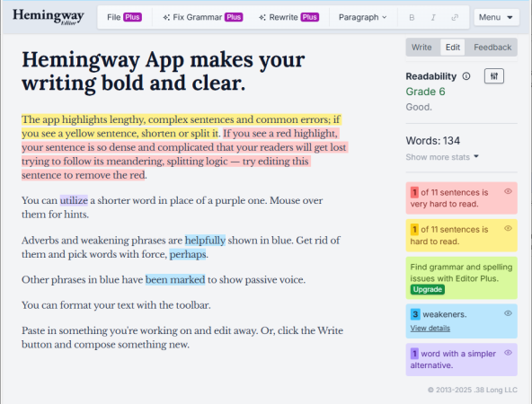

Resources
=========

.. image:: ../images/main-software-section-banner.png
   :target: ../images/main-software-section-banner.png
   :alt: Main software section banner

Main software 💻
----------------

==============================  ======  ==================================================
Name                            Cost    Notes
==============================  ======  ==================================================
**Installed software**
------------------------------------------------------------------------------------------
Libreoffice Writer (.odt)        ⊘      FLOSS
Microsoft Word (.docx)           $$      Most widely used
Apple Pages (.pages)             ⊘      MacOS only
**Web apps**
------------------------------------------------------------------------------------------
Google Docs                      ⊘
Zoho Office Writer               ⊘
Microsoft Word 365               ⊘
Naver Docs                       ⊘
==============================  ======  ==================================================

.. image:: ../images/fun-website-section-banner.png
   :target: ../images/fun-website-section-banner.png
   :alt: Fun website section banner

A fun website to play around with 🎉
------------------------------------

.. list-table::
   :header-rows: 1

   * - Tool
     - What it does
     - When to use it
   * - Hemingway Editor `Hemingwayapp.com <http://Hemingwayapp.com>`_
     - Gives suggestions to make your writing more simple and direct, similar to the style of `Ernest Hemingway <https://en.wikipedia.org/wiki/Ernest_Hemingway#Writing_style>`_
     - If you’re concerned that your writing is too convoluted and difficult to understand. Hemingway’s style isn’t the best for all situations, but it’s good for things like reports and slides (and journalism), where clear communication is more important than emotional impact.

.. image:: ../images/additional-tools-section-banner.png
   :target: ../images/additional-tools-section-banner.png
   :alt: Additional tools section banner

Additional tools 🛠️
-------------------

==============================  ======  ============================================================================================
Name                            Cost           Notes
==============================  ======  ============================================================================================
**Installed software**
------------------------------------------------------------------------------------------------------------------------------------
Notepad++                        ⊘      Plain text editor (Windows)
Adobe Acrobat                   $$$     Official software for editing PDFs |
**Web apps**
------------------------------------------------------------------------------------------------------------------------------------
PDF24                            ⊘      Installed & web app. Tools for editing PDFs
Pastebin                         ⊘      Web app. Platform for sharing plain text.
Overleaf                        ($)     Structured authoring software for academic and technical documents; write documents as code
VS Code + LaTeX plugins
==============================  ======  ============================================================================================

.. image:: ../images/key-terms-section-banner.png
   :target: ../images/key-terms-section-banner.png
   :alt: Key terms section banner

Key terms 📝
------------

====================  ======  =================================================================================================================
Term                  Symbol  Explanation
====================  ======  =================================================================================================================
**Font formatting**
-----------------------------------------------------------------------------------------------------------------------------------------------
Bold                          Text that is **thicker than normal**
Italics                       Text that is *slanted to the right*
Underline                     Text that is underlined
Strikethrough                 Text that has <del>a line through it</del>
Superscript                   Text that is :sup:`smaller and appears higher than normal text`
Subscript                     Text that is :sub:`smaller and appears lower than normal text`
Uppercase                     Text that is WRITTEN IN CAPITAL LETTERS
Lowercase                     Text that is written in non-capital letters

**Paragraph formatting**
-----------------------------------------------------------------------------------------------------------------------------------------------
Line spacing                  How much **space** there is **between each line** of a paragraph
Line break                    A formatting character that pushes next down to the next line without creating a new paragraph
Paragraph spacing             How much **space** there is **between each paragraph**
Paragraph break               A formatting character that creates a new paragraph
Alignment                     How each line of text is aligned (lined up) on the page. Text can be left aligned, centre aligned,
                              right aligned, or justified (aligned on both the left and right sides)
Indentation                   Whether a line or paragraph is further away from the page margins than normal text

**Page layout**
-----------------------------------------------------------------------------------------------------------------------------------------------
Margins                       How much empty space is left at each side of the page
Column break                  A formatting character that pushes the following text to the next column
Page break                    A formatting character that pushes the following text to the next page
Headers, footers              Text that appears at the top (header) or bottom (footer) of every page
Text wrapping                 How text flows around an object, such as an inserted picture
Table of contents             A list page numbers for each of the major sections of a document

**Styles**
-----------------------------------------------------------------------------------------------------------------------------------------------
Style                         A defined format for a type of text
                              Ex. ‘normal’, ‘title’, ‘heading 1’, ‘heading 2’
Style set                     A collection of styles that defines the overall look of a document

**General**
-----------------------------------------------------------------------------------------------------------------------------------------------
Unicode                       A text encoding standard that supports the use of text in all of the world's writing systems in a digital format.
Word processor                Any fully-featured software for making and editing documents. (Not just simple memo or note-taking apps.)
====================  ======  =================================================================================================================

File types 📂
-------------

==============  ========================  ======================================================================
File extension  Software                  Notes
==============  ========================  ======================================================================
``.txt``        Universal                 Plain text document
``.pdf``        Adobe Acrobat Universal   Gives consistent appearance on all devices 
                                          “\ **p**\ ortable \ **d**\ ocument \ **f**\ ormat”
``.docx``       MS Word                   Modern MS Word documents (since 2003)
``.doc``        MS Word                   Older MS Word documents (before 2003)
``.odt``        Open Office Libreoffice   Open Office document
``.pages``      Apple Pages               Pages document
==============  ========================  ======================================================================

.. image:: ../images/keyboard-shortcuts-section-banner.png
   :target: ../images/keyboard-shortcuts-section-banner.png
   :alt: Keyboard shortcuts section banner

Keyboard shortcuts ⌨️
---------------------

==============================================  =============================  ============================
Action                                          PC Keyboard                    Mac keyboard
==============================================  =============================  ============================
Undo                                            ``Ctrl + Z``                   ``⌘ + Z``
Redo                                            ``Ctrl + Y Ctrl + Shift + Z``  ``⌘ + Y ⌘ + Shift + Z``
Cut                                             ``Ctrl + X``                   ``⌘ + X``
Copy                                            ``Ctrl + C``                   ``⌘ + C``
Paste                                           ``Ctrl + V``                   ``⌘ + V``
Select all                                      ``Ctrl + A``                   ``⌘ + A``
Find                                            ``Ctrl + F``                   ``⌘ + F``
Find & replace                                  ``Ctrl + H``                   ``⌘ + H``
Comment                                         ``Ctrl + Alt + M``             ``⌘ + Alt + M``
Move cursor *by letter*                         ``↑,↓,←,→``                    ``↑,↓,←,→``
Move cursor *by word*                           ``Ctrl + ←,→``                 ``⌘ + ←,→ (?)``
Move cursor *by paragraph*                      ``Ctrl + ↑,↓``                 ``⌘ + ↑,↓ (?)``
Move cursor *to beginning / end of line*        ``Home / End``                 ``Home / End (?)``
Move cursor *to beginning / end of document*    ``Ctrl + Home / End``          ``⌘ + Home / End (?)``
Select text                                     ``Shift + ↑,↓,←,→``            ``Shift + ↑,↓,←,→``
Line break                                      ``Shift + Enter``              ``Shift + Enter``
Page break                                      ``Ctrl + Enter``               ``⌘ + Enter (?)``
==============================================  =============================  ============================

**Related links**

* **Video:** `How to use keyboard selection shortcuts <https://www.youtube.com/watch?v=DDLJUCKzBJw&ab_channel=DanielSchroeder>`_

.. image:: ../images/mouse-shortcuts-section-banner.png
   :target: ../images/mouse-shortcuts-section-banner.png
   :alt: Mouse shortcuts section banner

Mouse shortcuts 🐀
------------------
===========================  ======================  ======================
Action                        Mouse                   Touchpad
===========================  ======================  ======================
Select word                  ``Click × 2``           ``Click × 2``
Select paragraph             ``Click × 3``           ``Click × 3``
Free select *by letter*      ``Click & drag``        ``Click × 2 & drag``
Free select *by word*        ``Click × 2 & drag``    ``Click × 3 & drag``
Free select *by paragraph*   ``Click × 3 & drag``    ``Click × 4 & drag``
===========================  ======================  ======================

** Work to do on this page **

* Screenshots of icons in list of terms (from here? `Icon pack for symbols? <https://nucleoapp.com/icons/text-editing>`_\ )
* Video demonstration of mouse selection shortcuts
* Need to create section header images.
