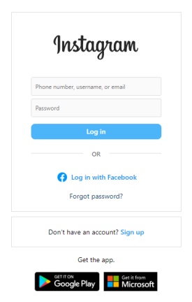
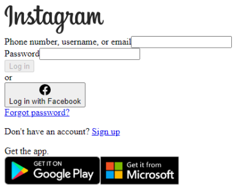
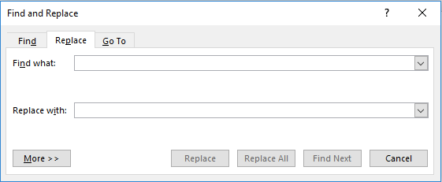
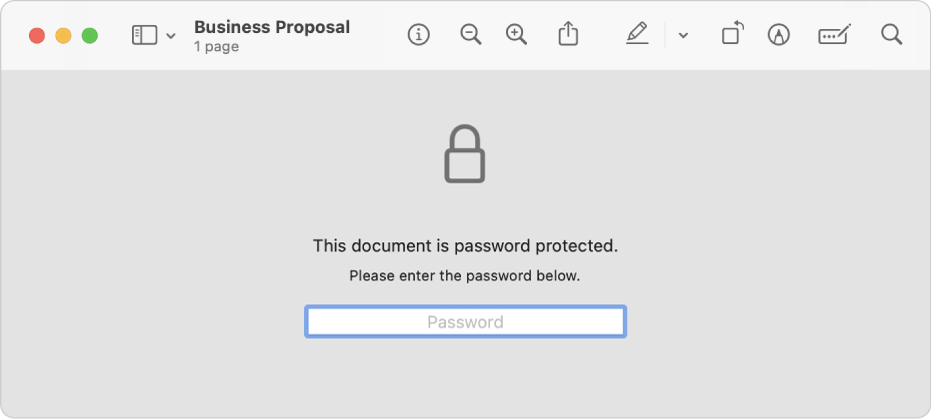

# What you need to know about documents

## Concept 01: 🔠🔡 Text vs. text formatting

In a document, **text** and the **formatting of that text** are *stored* separately.

* When copying text, the text and its formatting are copied together.  
* Formatting can be entirely removed without changing the text itself. There are various methods to remove formatting without changing the text itself. See Task 01\.

Documents with formatting are **rich text**. Documents without formatting are **plain text**.

* Plain text is useful and widely used. Not all types of documents and text require formatting.  
  * Most **messaging apps** only support plain text.  
  * **Posts** and **comments** on **most social media** only allow plain text.  
  * **Subject lines** of emails are plain text.  
  * Most simple **memo apps** on phones only support plain text.  
  * **Filenames** are plain text.  
  * Programmers write **software** using plain text.  
* The difference between rich text and plain text comes down to the software being used. If you can change the formatting of the text, it’s rich text (even if you personally didn’t make formatting changes).

Some basic formatting is stored inside plain text files as **formatting characters**. These all relate to spacing. A few common ones are shown below.

* These formatting characters are **normally hidden** from the user.  
  * Good document software allows you to **view formatting characters** if you choose.  
  * In MS Word, select the Pilcrow button  
  * In Google Docs, select “Show non-printing characters”  
* A few common ones are visible in the screenshot and described in the table below it

\[image showing non-printing characters in a document\]

| Name | Symbol |
| :---- | :---- |
| Space | · |
| Tab | ⭾ |
| New line | ↵ |
| New paragraph | ¶ |
| Column break | `——Column Break——` |
| Page break | `——Page Break——` |

**Related links**

* Article: [How to clear formatting in MS Word](https://xodo.com/blog/how-to-clear-formatting-in-word)

------

### Task 01a: Remove formatting from a source document

If we are going to format a block of text according to our own designs, we first need to remove any formatting that it already has.

**Instructions:** [Copy this text](https://pastebin.com/9P9tVNKv) and paste it into a word processing program **without any of the formatting from the source**.

* When finished, all of the text should have the default appearance in your word processor. There should be no numbers on the rows and no background colour on the text.

**Process:**

\[video\]

------

## Concept 02: 📏🎨 Styles & structured design

In good design work, text and the formatting of that text are *designed* separately.

* In a well made document, all text has a defined style associated with it that defines its appearance (its formatting), and all text with that same style has the same appearance.  
  * The formal term for this method of design is “structured authoring”.  
* Structured authoring is how all modern web pages are made. For most web pages, an .html file defines the page content and the styles of each piece of content, and a .css file defines the appearance of each of those styles.  
  * Websites [look very different with and without .css files](https://dev.to/vaibhavkhulbe/the-web-without-css-18d).

|  *The Instagram login page, with content \+ .css* |  *The Instagram login page, without .css* |
| :---: | :---: |

  
  * You can also modify the .css files to make a webpage look very different.

|  *You can freely change the appearance of any website …* |  *… by altering the page’s CSS file.* |
| :---: | :---: |

Academic documents – such as research papers and journal articles – have strict style guides that writers should follow. There are [many competing styles](https://libanswers.snhu.edu/faq/69000), each used in different academic fields. The most important part of these styles is their requirements for **references and citations**.

* The most common of these are **APA Style,** **Chicago Style**, and **MLA Style**.  
  * The business field often uses APA Style, while economics uses Chicago Style.  
* [APA Style](https://apastyle.apa.org/) is managed by the American Psychological Association. It is currently in its 7th version. APA Style is commonly used in the fields of humanities and social sciences.  
* [Chicago Manual of Style](https://www.chicagomanualofstyle.org/home.html) is managed by the University of Chicago Press. It is currently in its 18th version. Chicago Style is commonly used in the field of economics.  
* [MLA Style](https://style.mla.org/) is managed by the Modern Language Association of America. It is currently in its 9th version. MLA Style is commonly used in the field of economics.

**Related links**

* **Video:** [How to use styles in MS Word](https://www.youtube.com/watch?v=UOVU6qQ2iOM&ab_channel=KevinStratvert)  
* **Article:** [Official guide](https://apastyle.apa.org/style-grammar-guidelines) to APA Style and [interactive tutorial](https://extras.apa.org/apastyle/basics-7e/#/)  
  * **Article:** [Unofficial guide](https://owl.purdue.edu/owl/research_and_citation/apa_style/index.html) to APA Style from Purdue Online Writing Lab  
* **Article:** [Official guide](https://www.chicagomanualofstyle.org/book/ed18/frontmatter/toc.html) to Chicago Style (paywall)  
  * **Article:** [Unofficial guide](https://owl.purdue.edu/owl/research_and_citation/chicago_manual_17th_edition/cmos_overview_and_workshop.html) to Chicago Style from Purdue Online Writing Lab  
* **Article:** [Official guide](https://mlahandbookplus.org/books/book/5/MLA-Handbook) to MLA Style (paywall)  
  * **Article:** [Unofficial guide](https://owl.purdue.edu/owl/research_and_citation/mla_style/mla_overview_and_workshop.html) to MLA Style from Purdue Online Writing Lab

------

### Task 02a: Impose structure on a document

**Instructions:** Using the document you created in Task 01, format the text in the style of a general business report. The resulting document should look organized and professional. Specifically:

* The text is easy to read
* Structure of the document is easy to visually parse (even without reading any of the text)
* The text has a table of contents with links to each section of the document

**Conditions:** Apply the concepts of structured authoring when designing the document.

* Use the defined styles available in your word processing software.
* Insert a Table of Contents that is automatically generated based on the document’s contents.

**Tips:** Using styles makes your work faster and your results better looking and more flexible\!

* To apply a style: Select the relevant text, and then pick the appropriate style. “Normal” for the body text, “Title” for the title, “Heading 1” for the headings, “Heading 2” for the subheadings, etc.  
* To define a style: Manually format part of the text, then update the relevant style to match the current text.  
  * Tip: Define the “Normal” style first for your whole document, then modify the other styles afterward.  
* To create a Table of Contents: If you have applied styles to all of the headings in the document, your software can automatically create a Table of Contents for you.

**Process:** 

\[video\]

------

### Task 02b: Recreate an existing document

**Instructions:** Recreate the structure and appearance of this document, based on [this source text](https://pastebin.com/GwXpg29U), [this set of defined styles](https://pastebin.com/jh98xT8Y), and [this source image](https://imgur.com/a/dRHI5Cx). The end result [should look like this target document](https://drive.google.com/file/d/1zaKJNn6TJlRLFdfhjupcUf3iJBOOOvCr/view?usp=sharing).

**Conditions:** Apply the concepts of structured authoring when designing the document.

* Redefine the document’s styles, then apply those to the text.

**Tips:** I created the target document using Google Docs. You’re free to use any word processor that you like.

**Process:**

\[video\]

------

### Task 02c: Apply APA style to a document

**Instructions:** Apply APA style to [this research paper](https://pastebin.com/mJEMr3mZ).

**Tips:** The purpose of this task is to learn how complex some style guidelines are. If you need to write an actual paper using APA Style (or another common style), you can use a template instead.

* MS Word provides templates for APA Style and MLA Style.

*This task is adapted from [resources provided on the APA Style web page](https://apastyle.apa.org/style-grammar-guidelines/paper-format/sample-papers).*

------

## Concept 03: 🔍🔁 Structural changes

Documents can be changed and modified using **structural editing**.

* Document software, even simple memo tools, has a **find & replace** function.  
  * Any specific text can be replaced with other text across the entire document, all at once.  
  * The keyboard shortcut for **find** is usually **Ctrl \+ F / ⌘ \+ F**. The shortcut for **find & replace** is usually **Ctrl \+ H / ⌘ \+ H**.  
* In an installed word processor, find & replace also allows for **searching based on complex patterns**.  
  * **Ex.:** Format (such as bold, font, style)  
  * **Ex.:** Formatting characters (such as ⭾, ↵, ¶)  
  * **Ex.:** [Wildcards](https://support.microsoft.com/en-us/office/examples-of-wildcard-characters-939e153f-bd30-47e4-a763-61897c87b3f4) (such as any letter, any numeral, or any number of characters)

\[screenshot from MS word\]

* The most powerful way to search is to use Regular Expressions (‘RegEx’). RegEx allows for highly complex pattern matching, but is also difficult to learn.  
  * RegEx is widely used when writing programs that manipulate text or read data from files. It’s generally not used by everyday people, but it could be helpful to learn some basics.

\[screenshot from Notepad++\]

**Resources:**

* Video: [Basics of using find & replace in MS Word](https://support.microsoft.com/en-us/office/find-and-replace-text-c6728c16-469e-43cd-afe4-7708c6c779b7)  
* Video: [Advanced find & replace tutorial for MS Word](https://www.youtube.com/watch?v=8ZSlu4DWJ5k&ab_channel=TechnologyforTeachersandStudents)  
* Interactive website: [A tutorial about the basics of regex](https://regexone.com/)  
* Tool: [Break down regex expressions and test on any provided text](https://regexr.com/)

------

### Task 03a: Find & replace

**Instructions:** Make a copy of [this document](https://docs.google.com/document/d/1sS0-hr5MWTsEREdbntZJtkoVAeDGREpniTY8i9yqARw/copy). Using only the find & replace function, change the spellings of all of the words in the document to match U.K. English spelling rules.

**Process:**

\[video\]

------

# What you should keep in mind

| 📄📄📄📄📑📄📄📄 |
| :---: |

## Concept 04: 📃📜 Document appearance and consistency

Document appearance generally **isn’t consistent across devices**. However, the appearance of PDFs *is* **universally consistent**.

A document can **look different** in each program and on each device. The text is the same, but the formatting is **interpreted differently** by different software.

* Different programs (i.e. Microsoft Word & Google Docs) might disagree about how to render a document’s formatting. Even different versions of the same program can disagree.  
  * This is especially noticeable with tables and spacing.  
* If a document’s text uses a font that your computer doesn’t have, your computer will pick a different font as a replacement.  
* **Ex.:** Compare the following versions of a document  
  * [Version 1](https://drive.google.com/file/d/1Q7EYo-5yUYtd4QNSdWu3hvz-9ZMZm8Xh/view?usp=sharing): Created in MS Word, converted to PDF  
  * [Version 2](https://drive.google.com/file/d/1JdF2cYKw_foMQT9J-aJXL_UyLtfa6fk7/view?usp=sharing): Opened in MS Word on a different computer, then converted to PDF  
  * [Version 3](https://drive.google.com/file/d/1Ke6DQRDyYCR0w-YwvpvcEUyPFUfu8St_/view?usp=sharing): Opened in G Docs, then converted to PDF

\[side-by-side screenshots of each version, as a table\]

To have a **consistent appearance** on all devices, **export your document as a PDF** and share that version instead.

* PDFs are designed to always appear the same way on every device. For example, PDFs embed fonts inside the PDF file so that every person who opens the file will see the same font.  
* The tradeoff is that PDFs are difficult to edit. Most software for PDFs only reads PDFs; but some allow editing.  
* If the recipient needs to edit the file, don’t send a PDF. Send the original file.

------

## Concept 05: 📄🔐 Document security

Individuals and companies may have strong motivations to protect the contents of a document. However, documents are generally **not seen as a highly secure type of file**.

It’s **not possible** to completely prevent changes to a document. If you can **see the text**, you can **copy the text.**

* The process of copying the text and recreating the document may be **slow**, but it is **not difficult**.  
* Text from a PDF can be copied to a word processor, and then manual effort can be used to recreate the design of the original document.  
* If you read a book, you can scan the pages or manually type out each of the words and recreate the book as a document, which you could then sell or modify.  
  * You *shouldn’t* copy a text in this way; copying a copyrighted text without permission is copyright infringement and likely plagiarism. But you should know that it is possible.

With some word processors, you can **require a password** to open a document, but this also isn’t highly secure.

* Encryption itself on modern word processors is strong (using [AES-256](https://en.wikipedia.org/wiki/Advanced_Encryption_Standard)).  
* However, if you want to share a locked document with someone else, you need to also provide them with the password. **Passwords should never be shared.**  
  * Instead, share an unlocked document using a secure communication channel.  
* Applying a password on a document is only secure if you are the only person who needs access to the document and you use a strong password.

Word processor documents (.docx, .odt, [.pdf](https://www.adobe.com/acrobat/resources/can-pdfs-contain-viruses.html)) **can contain malware**.

* Word processors have many advanced functions that make use of **scripting**.  
  * As an example, [this .pdf](https://doompdf.pages.dev/doom.pdf) contains a playable version of the 1993 computer game Doom ([Source](https://doompdf.pages.dev/)). That’s quite unexpected for a file format that’s designed for documents.  
* **Scripting can be exploited** to put malware in a document. Any device that opens that document would be infected with the malware.  
* **Never open a file** if you’re not expecting it or if it looks suspicious.  
  * The strongest anti-malware software is the one that **runs in your brain**.

**Related links**

* Article: [Adobe \- Can PDFs contain viruses?](https://www.adobe.com/acrobat/resources/can-pdfs-contain-viruses.html)

------

| Unicode | Uɳιƈσԃҽ ǝpoɔıu∩ |  𝔘𝔫𝔦𝔠𝔬𝔡𝔢 Û̶͖̈́̍̃́̅ṇ̴̡̤͈̟̦̦̘̒̉͆̈́̕͝ĭ̵͔̻͎̪̠̼̤c̶̳̾͐̃̽̈́ǫ̵̞͖͈̯̺͈͈̠̾̈́̈́͗̿͂̄̂͠͠d̷͎͈͍͚͕̠̲̜̘̺͌̌̓̇̅̊̈́̏̀e̸̩͇͚̬̟̓́͛̃  |
| :---: | :---: | ----- |

## Concept 06: 🔢🔣🉐️ Text is Unicode

Unicode is the global standard for encoding text. Text from all languages and writing systems can be encoded using Unicode.

Video: [The Unicode Consortium Overview](https://www.youtube.com/watch?v=-n2nlPHEMG8)

* Text ‘encoding’ refers to changing text to numbers so that it can be understood by a computer.)  
* Unicode is universal, so your device can display [all of the writing systems that are part of Unicode](https://en.wikipedia.org/wiki/List_of_writing_systems#List_of_writing_systems_by_adoption): Arabic العربية, Greek Ελληνικά, Hangul 한글, Chinese 漢文, Sanskrit संस्कृत-, and more.  
* All emoji are defined by Unicode.⌘  
  * Emoji are a type of text character, but they don’t depend on individual fonts.  
  * Instead, [each operating system defines the appearance](https://emojipedia.org/party-popper#designs) of each emoji.  
  * Appearance of Unicode emoji [may differ depending on the device](https://emojipedia.org/party-popper#designs), but all devices have an emoji for each of the Unicode characters.

Unicode characters can be used to add **visual imagery** to documents that don’t support rich text or images.

* Unicode characters include many symbols for various technical purposes.  
  * **Ex.:** ↩, ◕, ⟁, ⬟, ☵, ⧮, ⠮, ‽, 🗹, ©, ₩, £  
* Plain text documents **don’t allow images, formatting or rich text**. Plain text documents do **allow all Unicode characters**.

**Related links**

* [The official Unicode website](https://home.unicode.org/)  
* [Search tool for Unicode characters](http://xahlee.info/comp/unicode_index.html?q=)  
* [Emojipedia: Dictionary for emoji meanings](https://emojipedia.org/)  
* [Emoji Finder: Emoji search tool](https://emojifinder.com/)  
* [Quiz: Guess the movie title based on emoji](https://www.britannica.com/quiz/guess-the-movie-emoji-quiz)

# How you can go further

**Get a certification**

* [Microsoft offers paid exams and certifications for MS Word](https://learn.microsoft.com/en-us/credentials/browse/?products=office-word)  
* [Google offers free training and certification for Google Docs](https://cloud.google.com/learn/training/workspace)

**Explore advanced functions**

* [Add-ins for MS Word](https://appsource.microsoft.com/en-us/marketplace/apps?product=office%3Bword&page=1)  
* [Add-ons for Google Docs](https://workspace.google.com/marketplace?host=docs)  
* [Extensions for LibreOffice Writer](https://extensions.libreoffice.org/extensions?Tags%5B0%5D=44&start=0&ord=download_d)

**Add new functions**

* [Add-ins for MS Word](https://appsource.microsoft.com/en-us/marketplace/apps?product=office%3Bword&page=1)  
* [Add-ons for Google Docs](https://workspace.google.com/marketplace?host=docs)  
* [Extensions for LibreOffice Writer](https://extensions.libreoffice.org/extensions?Tags%5B0%5D=44&start=0&ord=download_d)

**Do some extra reading**

* [Fonts Knowledge \- Google Fonts](https://fonts.google.com/knowledge)
